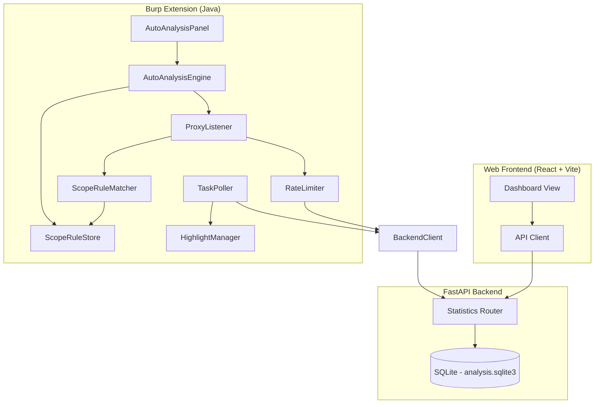

# Design Document: Dashboard Overview & Auto-Analysis

## Overview

本设计文档描述 Burp Copilot 的两个核心增强功能的技术实现方案：

1. **Dashboard 概览页面** — 在 Web 前端新增仪表盘首页，展示分析统计、严重性分布和最近发现时间线。后端新增 Statistics API 提供聚合数据。
2. **自动分析规则引擎** — 在 Burp 扩展中新增 Scope Rule 配置、URL 匹配、自动流量提交、Proxy History 高亮标记和 UI 配置面板。

### 设计决策

| 决策 | 选择 | 理由 |
|------|------|------|
| 统计 API 实现方式 | 直接 SQL 聚合查询 | 数据量小（本地工具），无需缓存层 |
| 前端图表库 | 纯 CSS/SVG 实现 donut chart | 避免引入重量级图表库，项目无现有图表依赖 |
| Scope Rule 存储 | Montoya persistence API (JSON 序列化) | 与现有 ExtensionSettings 一致，无需额外依赖 |
| URL 匹配算法 | 自定义 glob matcher | Java 标准库无直接 glob-to-URL 支持，需处理 scheme/host 特殊逻辑 |
| 速率限制 | Token bucket (令牌桶) | 简单高效，允许短暂突发 |
| 任务轮询 | 5 秒定时器 + 后台线程 | 避免 WebSocket 复杂性，与现有 BackendClient 模式一致 |

## Architecture



### 数据流

1. **Dashboard 数据流**: Frontend → `GET /api/v1/statistics` → Backend 聚合 SQLite → JSON 响应 → 前端渲染
2. **自动分析数据流**: HTTP 流量 → Burp Proxy → ProxyListener → ScopeRuleMatcher → RateLimiter → BackendClient → `POST /api/v1/batch/submit` → TaskPoller 轮询 → HighlightManager 标记

## Components and Interfaces

### Backend: Statistics Router

新增 `backend/app/services/statistics_service.py`:

```python
class StatisticsService:
    def __init__(self, history_store: HistoryStore):
        self.history = history_store

    def get_statistics(self, since: str | None = None) -> StatisticsResponse:
        """聚合统计数据，可选 since 时间过滤"""
        ...

    def get_recent_findings(self, limit: int = 20) -> list[RecentFinding]:
        """获取最近发现，按 created_at 降序"""
        ...
```

新增路由注册在 `main.py`:

```python
@app.get("/api/v1/statistics")
async def get_statistics(since: str | None = Query(default=None)):
    ...

@app.get("/api/v1/statistics/recent-findings")
async def get_recent_findings(limit: int = Query(default=20, ge=1, le=100)):
    ...
```

### Backend: Response Schemas

新增 `backend/app/models/schemas.py` 中的模型:

```python
class SeverityDistribution(BaseModel):
    critical: int = 0
    high: int = 0
    medium: int = 0
    low: int = 0
    info: int = 0

class TopVulnerabilityType(BaseModel):
    owasp_category: str
    count: int

class StatisticsResponse(BaseModel):
    total_analyses: int
    success_rate: float  # 0.0 - 1.0
    severity_distribution: SeverityDistribution
    top_vulnerability_types: list[TopVulnerabilityType]

class RecentFinding(BaseModel):
    title: str
    severity: Severity
    confidence: float
    owasp_category: str | None
    analysis_id: str
    target_url: str | None
    created_at: str
```

### Frontend: Dashboard View

新增 Dashboard 作为默认视图，替代当前 Analyze 视图作为首页。

组件结构:
- `DashboardView` — 顶层容器，负责数据获取
- `StatCards` — 快速统计卡片（总分析数、成功率、Top 漏洞类型）
- `SeverityDonut` — SVG donut chart 展示严重性分布
- `FindingsTimeline` — 最近发现时间线列表
- `EmptyDashboard` — 空状态引导

API Client 新增:
```typescript
export function fetchStatistics(since?: string): Promise<StatisticsResponse> { ... }
export function fetchRecentFindings(limit?: number): Promise<RecentFinding[]> { ... }
```

### Burp Extension: Auto-Analysis Engine

新增 Java 类:

| 类 | 职责 |
|----|------|
| `ScopeRuleStore` | 使用 Montoya persistence API 持久化 scope rules (JSON 数组) |
| `ScopeRuleMatcher` | 将 URL 与 glob patterns 进行匹配 |
| `AutoAnalysisProxyListener` | 实现 `HttpHandler`，监听 proxy 流量 |
| `SubmissionRateLimiter` | 令牌桶速率限制器 (10/s) |
| `TaskPoller` | 定时轮询后端任务状态 |
| `HighlightManager` | 根据分析结果设置 Proxy History 高亮和注释 |
| `AutoAnalysisPanel` | Swing UI 面板，嵌入现有 Extension panel |

#### ScopeRuleStore 接口

```java
public class ScopeRuleStore {
    public ScopeRuleStore(MontoyaApi api) { ... }
    public List<String> getRules() { ... }
    public void addRule(String pattern) throws ValidationException { ... }
    public void removeRule(String pattern) { ... }
}
```

#### ScopeRuleMatcher 接口

```java
public class ScopeRuleMatcher {
    public ScopeRuleMatcher(ScopeRuleStore store) { ... }
    public boolean isInScope(String url) { ... }
}
```

匹配规则:
- `*` 匹配单个域名段内的任意字符（不跨越 `.` 或 `/`）
- `**` 匹配跨段的任意字符
- 无 scheme 前缀时同时匹配 http 和 https
- host 部分大小写不敏感

#### SubmissionRateLimiter 接口

```java
public class SubmissionRateLimiter {
    private static final int MAX_PER_SECOND = 10;
    public boolean tryAcquire() { ... }
}
```

#### AutoAnalysisProxyListener

```java
public class AutoAnalysisProxyListener implements ProxyResponseHandler {
    // 在 responseReceived 中:
    // 1. 检查 auto-analysis 是否启用
    // 2. ScopeRuleMatcher.isInScope(url)
    // 3. HttpMessageFilter.prepare() 检查是否为静态资源
    // 4. RateLimiter.tryAcquire()
    // 5. 异步提交到 BackendClient (ExecutorService)
    // 6. 记录 HttpRequestResponse 引用用于后续高亮
}
```

#### TaskPoller

```java
public class TaskPoller {
    private final ScheduledExecutorService scheduler;
    private static final int POLL_INTERVAL_SECONDS = 5;
    // 维护 pending task_id -> HttpRequestResponse 映射
    // 轮询 GET /api/v1/batch/tasks/{task_id}
    // 任务完成时调用 HighlightManager
}
```

#### HighlightManager

```java
public class HighlightManager {
    // 颜色映射:
    // critical -> RED, high -> ORANGE, yellow -> MEDIUM
    // low -> BLUE, info -> GRAY, failure -> MAGENTA
    public void applyHighlight(HttpRequestResponse item, TaskInfo task) { ... }
}
```

## Data Models

### SQLite Schema (无变更)

Statistics API 直接查询现有 `analysis_history` 和 `task_queue` 表，无需新增表或列。

聚合查询示例:

```sql
-- Total analyses count
SELECT COUNT(*) FROM analysis_history WHERE created_at >= ?;

-- Severity distribution
SELECT severity, COUNT(*) as count
FROM (
    SELECT json_each.value->>'severity' as severity
    FROM analysis_history, json_each(findings_json)
    WHERE created_at >= ?
)
GROUP BY severity;

-- Success rate
SELECT
    CAST(SUM(CASE WHEN llm_status IN ('ok', 'repaired') THEN 1 ELSE 0 END) AS REAL) / COUNT(*)
FROM analysis_history
WHERE created_at >= ?;

-- Top vulnerability types
SELECT json_each.value->>'owasp_category' as category, COUNT(*) as count
FROM analysis_history, json_each(findings_json)
WHERE created_at >= ? AND category IS NOT NULL
GROUP BY category
ORDER BY count DESC
LIMIT 5;
```

### Burp Extension Persistence Schema

Scope rules 存储为 JSON 数组字符串，使用 Montoya persistence key `auto_analysis_scope_rules`:

```json
["*.target.com", "api.example.com/**", "*.internal.corp/admin/*"]
```

Auto-analysis 启用状态存储为 key `auto_analysis_enabled`，值为 `"true"` 或 `"false"`。

### Frontend Types (新增)

```typescript
interface SeverityDistribution {
  critical: number;
  high: number;
  medium: number;
  low: number;
  info: number;
}

interface TopVulnerabilityType {
  owasp_category: string;
  count: number;
}

interface StatisticsResponse {
  total_analyses: number;
  success_rate: number;
  severity_distribution: SeverityDistribution;
  top_vulnerability_types: TopVulnerabilityType[];
}

interface RecentFinding {
  title: string;
  severity: Severity;
  confidence: number;
  owasp_category: string | null;
  analysis_id: string;
  target_url: string | null;
  created_at: string;
}
```

## Correctness Properties

*A property is a characteristic or behavior that should hold true across all valid executions of a system — essentially, a formal statement about what the system should do. Properties serve as the bridge between human-readable specifications and machine-verifiable correctness guarantees.*

### Property 1: Severity distribution sum equals total findings

*For any* set of analysis records with findings, the sum of all values in the severity distribution mapping SHALL equal the total number of findings across all included analyses.

**Validates: Requirements 1.2**

### Property 2: Success rate formula correctness

*For any* set of analysis records, the success rate SHALL equal the count of records with `llm_status` in ("ok", "repaired") divided by the total record count, yielding 0.0 when no records have succeeded.

**Validates: Requirements 1.3**

### Property 3: Top vulnerability types ranking

*For any* set of findings with `owasp_category` values, the returned top vulnerability types SHALL be the 5 most frequent categories ordered by count descending, with no category appearing that has a lower count than any omitted category.

**Validates: Requirements 1.4**

### Property 4: Since filter restricts computation scope

*For any* set of analysis records with varying timestamps and a given `since` ISO 8601 value, all statistics computations SHALL only include records where `created_at >= since`.

**Validates: Requirements 1.5**

### Property 5: Recent findings ordering and field completeness

*For any* set of analysis records with findings, the recent-findings endpoint SHALL return findings ordered by parent analysis `created_at` descending, limited to at most `limit` items, and each item SHALL contain all required fields (title, severity, confidence, owasp_category, analysis_id, target_url, created_at).

**Validates: Requirements 2.1, 2.2, 2.3**

### Property 6: Scope rule persistence round-trip

*For any* sequence of valid add and remove operations on scope rules, persisting and then reloading the rule store SHALL produce a list containing exactly the rules that were added and not subsequently removed.

**Validates: Requirements 4.1, 4.2, 4.3**

### Property 7: Whitespace pattern rejection

*For any* string composed entirely of whitespace characters (including empty string), attempting to add it as a scope rule SHALL be rejected, and the existing rule list SHALL remain unchanged.

**Validates: Requirements 4.5**

### Property 8: URL scope matching correctness

*For any* URL and set of scope rule patterns, the matcher SHALL classify the URL as in-scope if and only if it matches at least one pattern, applying scheme-agnostic matching (patterns without scheme match both http and https) and case-insensitive host comparison.

**Validates: Requirements 5.1, 5.3, 5.4**

### Property 9: Glob wildcard segment boundaries

*For any* URL with multiple path or domain segments, a `*` wildcard in a pattern SHALL match characters only within a single segment (not crossing `.` in host or `/` in path), while `**` SHALL match across segment boundaries.

**Validates: Requirements 5.2**

### Property 10: Rate limiter enforcement

*For any* sequence of submission attempts, the rate limiter SHALL permit at most 10 successful acquisitions within any 1-second sliding window.

**Validates: Requirements 6.5**

### Property 11: Severity-to-highlight-color mapping

*For any* completed task with findings, the highlight color applied SHALL correspond to the highest severity finding present (red=critical, orange=high, yellow=medium, blue=low, gray=info), and for failed tasks with no findings the color SHALL be magenta.

**Validates: Requirements 7.2, 7.4, 7.5**

### Property 12: i18n key completeness

*For any* locale key referenced by the Dashboard component, both the Chinese (zh) and English (en) translation files SHALL contain a non-empty string value for that key.

**Validates: Requirements 3.6**

## Error Handling

### Backend Statistics API

| 场景 | 处理方式 |
|------|----------|
| 无分析记录 | 返回零值和空列表，HTTP 200 |
| `since` 格式无效 | HTTP 422，detail 说明格式要求 |
| `limit` 超出范围 | FastAPI 自动验证，HTTP 422 |
| SQLite 查询失败 | HTTP 500，记录日志 |

### Burp Extension Auto-Analysis

| 场景 | 处理方式 |
|------|----------|
| Backend 不可达 | 记录错误到 Burp output，跳过当前请求，继续处理后续请求 |
| Backend 返回 4xx/5xx | 记录错误，不重试，继续处理 |
| 速率限制触发 | 静默丢弃当前请求（不阻塞） |
| Scope rule 验证失败 | 显示 UI 错误提示，不存储 |
| 高亮/注释设置失败 | 记录警告，继续（非致命） |
| TaskPoller 网络错误 | 记录警告，下次轮询重试 |
| Montoya persistence 失败 | 记录错误，内存中保持当前状态 |

### Frontend Dashboard

| 场景 | 处理方式 |
|------|----------|
| Statistics API 请求失败 | 显示错误通知，保留上次数据（如有） |
| 网络超时 | 显示重试按钮 |
| 数据为空 | 显示空状态引导界面 |

## Testing Strategy

### Backend (Python - pytest)

**单元测试:**
- `test_statistics_service.py` — 测试 StatisticsService 的聚合逻辑
- 测试空数据库、单条记录、多条记录场景
- 测试 `since` 过滤逻辑
- 测试 `limit` 参数边界

**属性测试 (hypothesis):**
- 使用 `hypothesis` 库
- 最少 100 次迭代
- 每个属性测试标注对应的 Property 编号

```python
# Feature: dashboard-overview-auto-analysis, Property 1: Severity distribution sum equals total findings
@given(analyses=st.lists(analysis_strategy(), min_size=0, max_size=50))
def test_severity_distribution_sum(analyses): ...

# Feature: dashboard-overview-auto-analysis, Property 2: Success rate formula correctness
@given(analyses=st.lists(analysis_strategy(), min_size=1, max_size=50))
def test_success_rate_formula(analyses): ...
```

**集成测试:**
- `test_statistics_api.py` — 端到端 API 测试（使用 TestClient）

### Frontend (TypeScript - vitest)

**单元测试:**
- Dashboard 组件渲染测试（mock API 响应）
- 空状态显示测试
- i18n 键完整性测试

**属性测试 (fast-check):**
- 使用 `fast-check` 库
- 测试 i18n 键完整性 (Property 12)

### Burp Extension (Java - JUnit 5)

**单元测试:**
- `ScopeRuleMatcherTest` — 各种 URL 和 pattern 组合
- `ScopeRuleStoreTest` — 持久化 round-trip（mock Montoya API）
- `SubmissionRateLimiterTest` — 速率限制行为
- `HighlightManagerTest` — severity-to-color 映射

**属性测试 (jqwik):**
- 使用 `jqwik` 库
- 最少 100 次迭代

```java
// Feature: dashboard-overview-auto-analysis, Property 8: URL scope matching correctness
@Property(tries = 100)
void urlMatchingCorrectness(@ForAll String url, @ForAll List<String> patterns) { ... }

// Feature: dashboard-overview-auto-analysis, Property 9: Glob wildcard segment boundaries
@Property(tries = 100)
void globWildcardBoundaries(@ForAll("multiSegmentUrl") String url) { ... }
```

### 测试覆盖矩阵

| Property | 测试位置 | 框架 |
|----------|----------|------|
| P1: Severity distribution sum | backend/tests/test_statistics_properties.py | hypothesis |
| P2: Success rate formula | backend/tests/test_statistics_properties.py | hypothesis |
| P3: Top vuln types ranking | backend/tests/test_statistics_properties.py | hypothesis |
| P4: Since filter | backend/tests/test_statistics_properties.py | hypothesis |
| P5: Recent findings ordering | backend/tests/test_statistics_properties.py | hypothesis |
| P6: Scope rule round-trip | burp-extension ScopeRuleStorePropertyTest | jqwik |
| P7: Whitespace rejection | burp-extension ScopeRuleStorePropertyTest | jqwik |
| P8: URL matching | burp-extension ScopeRuleMatcherPropertyTest | jqwik |
| P9: Glob boundaries | burp-extension ScopeRuleMatcherPropertyTest | jqwik |
| P10: Rate limiter | burp-extension RateLimiterPropertyTest | jqwik |
| P11: Severity-to-color | burp-extension HighlightManagerPropertyTest | jqwik |
| P12: i18n completeness | frontend/src/test/i18n.property.test.ts | fast-check |
